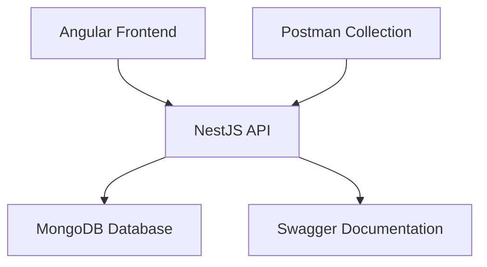

# 📚 Library Management System Documentation

Welcome to the comprehensive documentation for the Library Management System.

## 📁 Documentation Structure

- **[API Documentation](api.md)** - Complete API reference with examples
- **[Database Schema](database.md)** - MongoDB collection schemas and relationships
- **[Setup Guide](setup.md)** - Detailed installation and configuration
- **[Development Guide](development.md)** - Development workflow and best practices
- **[Testing Guide](testing.md)** - Testing strategies and examples
- **[Deployment Guide](deployment.md)** - Production deployment instructions

## 🚀 Quick Links

- **[Swagger UI](http://localhost:3002/api)** - Interactive API documentation
- **[Postman Collection](../postman/)** - API testing collection
- **[Backend Source](../backend/)** - NestJS backend code
- **[Frontend Source](../frontend/)** - Angular frontend code (Coming Soon)

## 📋 Current Status

### ✅ Completed Features
- RESTful API with NestJS
- MongoDB database integration
- Book, Author, and Borrower management
- Input validation and error handling
- Swagger API documentation
- Comprehensive Postman collection

### 🔄 In Development
- Lending system for book borrowing
- Advanced search and filtering
- Unit and E2E test coverage
- Angular frontend application

### 📋 Planned Features
- User authentication and authorization
- Email notifications for overdue books
- Reporting and analytics dashboard
- Docker containerization
- Cloud deployment on Azure

## 🎯 System Architecture

## 🛠️ Technology Stack

### Backend
- **NestJS** - Progressive Node.js framework
- **TypeScript** - Type-safe JavaScript
- **MongoDB** - NoSQL database
- **Mongoose** - Object modeling for MongoDB
- **Swagger** - API documentation

### Frontend (Planned)
- **Angular** - Modern web framework
- **Angular Material** - UI components
- **RxJS** - Reactive programming

### Development Tools
- **Postman** - API testing
- **Jest** - Testing framework
- **ESLint** - Code linting
- **Prettier** - Code formatting

## 📞 Support

For help and support:
1. Check the relevant documentation section
2. Review the API examples in Postman
3. Open an issue on GitHub
4. Contact the development team
